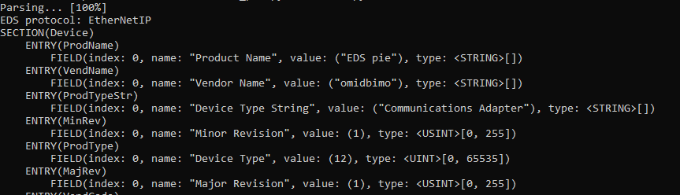
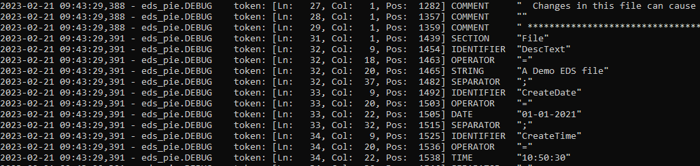

# EDS pie

**EDS parser library for ODVA's CIP® protocol family(EtherNet/IP®, DeviceNet®,...)**


### The following are trademarks of ODVA:
CIP, CIP Energy, CIP Motion, CIP Security, CIP Safety, CIP Sync, CompoNet, ControlNet, DeviceNet,
EtherNet/IP, QuickConnect.

Visit http://www.odva.org for product information and publications

### What is an EDS
An Electronic Data Sheet (EDS), in the context of industrial communication, is a plain-text file that describes a device in terms of its parameters, capabilities, and I/O data structure. It provides all information necessary to identify the device, access its data, and configure its parameters when the device supports communication protocols such as CIP or CANopen.

### What does EDS Pie offer?

* Parsing EDS text files into a structured, hierarchical representation of sections, entries, and fields, as defined by the CIP specification
* Programmatic creation, modification, and removal of sections, entries, and fields
* Serialization of in-memory EDS objects back into a valid EDS plain-text file
* Converting EDS data to JSON fromat


## Setup
```
pip install git+https://github.com/omidbimo/eds_pie.git
```

## Usage
**EDS Pie** consists of two primary components: a **parser/serializer** and a **semantic checker**.  

To validate the contents of an Electronic Datasheet correctly, EDS Pie relies on **protocol-specific reference definitions**. These references describe the valid sections, entries, and fields as specified by **ODVA** for each supported protocol.

### Current Implementation

The current implementation provides a reference library only for **EtherNet/IP**, located at: **eds_pie/references/ethernetip_lib.json**


### Adding Support for Other Protocols

To support additional protocols—such as **DeviceNet**—a corresponding protocol-specific reference must be added to the `eds_pie/references/` directory.  

Requirements for the reference:

- Must be in **JSON format**.
- Must strictly conform to the schema defined in: **eds_pie/references/edslib_schema.json**  

Once such a reference is added, EDS Pie can process and semantically validate EDS files for the corresponding protocol without further changes to the core codebase.


```python
# Demo1.py

from eds_pie import CIP_EDS

with open('demo.eds', 'r') as src:
    eds_content = src.read()

eds = CIP_EDS(eds_content)
print("EDS Protocol: {}".format(eds.protocol or "Generic"))  

eds.list() # Lists all objects in the EDS file 
# or
print(eds) # Print the serialized EDS

```




## API Reference

### EDS object

- EDS.get_section( section_keyword, class_id ) # Get a section object by it's keyword or it's classId
- EDS.get_entry( section_keyword, entry_keyword ) # Get an Entry object
- EDS.get_field(  section_keyword, entry_keyword, field_index ) # Get a Field Object by its index
- EDS.get_value( section_keyword, entry_keyword, field_index=0 ) # Get the value of a field
- EDS.has_section( section_keyword )
- EDS.has_entry( section_keyword, entry_keyword )
- EDS.has_field( section_keyword, entry_keyword, field_index )
- EDS.add_section( section_keyword )
- EDS.add_entry( section_keyword, entry_keyword )
- EDS.add_field( section_keyword, entry_keyword, field_value, *[field_data_type]*=None ) # field_data_type must be one of defined CIP_TYPES from cip_eds_types module 
- EDS.list() # Lists all objects in the EDS
- EDS.validate() # Performs semantic validation of the EDS data structure. Validation is automatically executed after each parsing operation. It may also be invoked explicitly at any time to validate the current state of the EDS contents.
- EDS.save( filename, *[overwrite]*=False )	# To save the EDS contents into a file
- EDS.__str__() # Or str(eds) returns a pretty print string representation of the EDS objects
- EDS.protocol 	# CIP Protocol recognized during the parsing
- EDS.sections  # Representation of all EDS sections as a dictionary of {section_keyword: section_object}
- EDS.hcomment # EDS File Header comment
- EDS.fcomment # End comment of the EDS file
- EDS.to_json() # Export EDS data to as a JSON object

### Section object

- Section.get_entry( entry_keyword )
- Section.get_field( entry_keyword, field_index )
- Section.get_value( entry_keyword, field_index=0 )
- Section.has_entry( entry_keyword )
- Section.add_entry( entry_keyword )
- Section.list()
- Section.entries # Representation of all EDS entries as a dictionary of {entry_keyword: entry_object}
- Section.name # Full descriptive name of the Section
- Section.hcomment # This is the comment appears before the Section
- Section.fcomment # This is the section appears after the section on the same line


### Entry object

- Entry.get_field( field_index )
- Entry.get_value( field_index )
- Entry.add_field( field_value, *[field_data_type]*=None ) # field_data_type must be one of defined CIP_TYPES from cip_eds_types module 
- Entry.list()
- Entry.name # Full descriptive name of the Entry
- Entry.fields # Representation of all EDS fields in as a list 
- Entry.hcomment # This is the comment appears before an Entry
- 
### Field object

- Field.name # Full descriptive name of the Field
- Field.value # Field value in the form of python types (str, int,...)
- Field.data # CIP_TYPES object that holds the actuall value of the field 
- Field.data_types # A list of valid data types (if any) for this specific field. This comes from the reference libraries
- Field.hcomment # This is the comment appears before a Field
- Field.fcomment # This is the comment appears after a Field


## Debug mode

To retrieve the maximum information about the parsing process, set the logging level of eds_pie to DEBUG. In the debug mode, a list of parsed tokens will be displayed.

```python
import logging

logging.basicConfig(level=logging.DEBUG,
    format='%(asctime)s - %(name)s.%(levelname)-8s %(message)s')
logger = logging.getLogger(__name__)

from eds_pie import eds_pie

with open('demo.eds', 'r') as srcfile:
    eds_content = srcfile.read()
eds = CIP_EDS(eds_content)
```




## Contributing

EDS Pie is designed to be **extensible and collaborative**. Contributions are appreciated in several forms, including:  

- Adding new **protocol-specific reference libraries**.
- Improving or extending the functionality.
- Enhancing **documentation** or providing usage examples.

