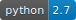

# EDS pie

**EDS parser library for ODVA's CIP® protocol family(EtherNet/IP®, DeviceNet®,...)**

 


### The following are trademarks of ODVA:
CIP, CIP Energy, CIP Motion, CIP Security, CIP Safety, CIP Sync, CompoNet, ControlNet, DeviceNet,
EtherNet/IP, QuickConnect.

Visit http://www.odva.org for product information and publications

### What is an EDS
EDS stands for Electronic Data Sheet and is a set of data that provides all of the information necessary to access and alter the configurable
parameters of a device (CIP, CANopen, ...).

### Who may need an EDS parser library

Use cases:

- ​	Batch processing of EDS files
  - To find out which devices are supporting a specific CIP object or feature (i.e. CIP Security)
  - To change contents of multiple of EDS files (i.e. Add a new section to all EDSs with a specific ProductCode)
- Automation
  - To implement automated scripts/tests
    - The test script uses EDS_pie to parse the IO assembly path and starts an IO communication
    - To implement QA scripts to make sure the EDS file matches a device configuration
    - To Create new EDS files
- Format conversion
  - To convert EDS data into other formats such as XML / JSON and feed the applications that do not understand the EDS notations


## Usage

```python
# Demo1.py
from eds_pie import eds_pie

with open('demo.eds', 'r') as srcfile:
    eds_content = srcfile.read()
eds = eds_pie.parse(eds_content, showprogress = True)

print eds.protocol

for section in eds.sections:
    print section
    for entry in section.entries:
        print '   ', entry
        for field in entry.fields:
            print '       ', field
## or use the list method of the eds object
eds.list()
eds.list('file')
eds.list('file', 'DescText')
```


```python
# Demo2.py

from eds_pie import eds_pie

with open('demo.eds', 'r') as srcfile:
    eds_content = srcfile.read()
eds = eds_pie.parse(eds_content, showprogress = True)

if eds.protocol == 'EtherNetIP':
    entry = eds.getentry('device', 'ProdType')
    field = entry.fields[0]
    if field.value == 12:
        print 'This is an EtherNet/IP Communication adapter device.'
    # Alternate way: The value attribute of an entry always returns its first field value.
    if entry.value == 12:
        print 'This is an EtherNet/IP Communication adapter device.'

    if eds.hassection(0x5D):
        eds.list(eds.get_cip_section_name(0x5D))
        '''
        The device is capable of CIP security.
        Do some stuff with security objects.
        '''
    else:
        print 'Device doesn\'t support CIP security'


```


## API Reference

### EDS object methods

- EDS.addsection( sectionname )
- EDS.addentry( sectionname, entryname )
- EDS.addfield( sectionname, entryname, fieldvalue, *[fielddatatype]* )
- EDS.getsection( sectionname/cip_class_id ) To get a specific section element
- EDS.getentry( sectionname, entryname ) To get a sepecific entry element
- EDS.getfield( sectionname, entryname, fieldindex / fieldname ) To get a sepecific field element
- EDS.getvalue( sectionname, entryname, fieldindex / fieldname ) To get the value of an addressed field
- EDS.get_cip_section_name(classid, protocol=None) To get the section_kay for a CIP object specified by its CIP Class ID
- EDS.hassection( sectionname/cip_class_id )
- EDS.hasenry( sectionname, entryname )
- EDS.hasfield( sectionname, entryname, fieldindex )
- EDS.list( *[sectionname],* *[entryname]*) To print out a list of EDS elements (sections, entries, fields)
- EDS.removesection( sectionname )
- EDS.removeentry( sectionname, entryname )
- EDS.removefield( sectionname, entryname, fieldindex )
- EDS.resolve_epath( epath ) To resolve an epath containing reference to params
- EDS.save( *[filename], [overwrite]* )	To save the EDS contents into a file
- EDS.setvalue( sectionname, entryname, fieldindex, value ) To set value of an addressed field

### EDS object attributes

- EDS.protocol 	To get the string protocol name of the eds file (generic, EtherNetIP, ...)
- EDS.sections  An iterable list of EDS sections

### Section object methods

- section.getentry( entryname )

- section.addentry( entryname )
- section.getfield( entryname, fieldindex / fieldname )

### Section object attributes

- section.name			to get string name of the section
- section.entrycount   to get the number of entries for this section
- section.entries         An iterable list of Section Entries

### Entry object methods

- entry.getfield( fieldindex / fieldname )
- entry.addfield( fieldvalue, *[datatype]* )

### Entry object attributes

- entry.name			to get string name of the entry
- entry.fieldcount   to get the number of fields for this entry
- entry.fields          An iterable list of Entry Fields

### Field object attributes

- field.name			to get string name of the field
- field.index            to get the index of this field in the of parent entry fields
- field.value            to get / set the value of the field
- field.datatype       to get the data-type object of this field


**All object are printable using the print instruction**


## Debug mode

To retrieve the maximum information about the parsing process, set the logging level of eds_pie to DEBUG. In the debug mode, a list of parsed tokens will be displayed.

```python
import logging

logging.basicConfig(level=logging.DEBUG,
    format='%(asctime)s - %(name)s.%(levelname)-8s %(message)s')
logger = logging.getLogger(__name__)

from eds_pie import eds_pie

with open('demo.eds', 'r') as srcfile:
    eds_content = srcfile.read()
eds = eds_pie.parse(eds_content, showprogress = True)
```


