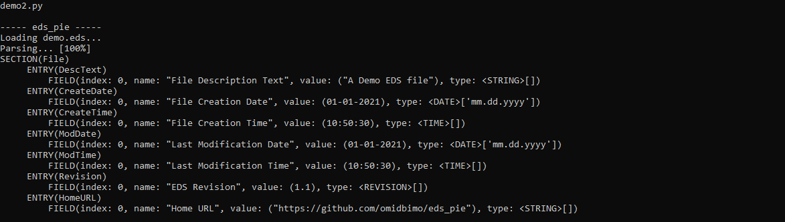
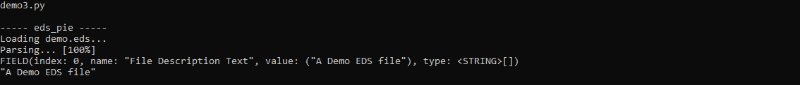
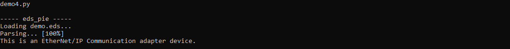
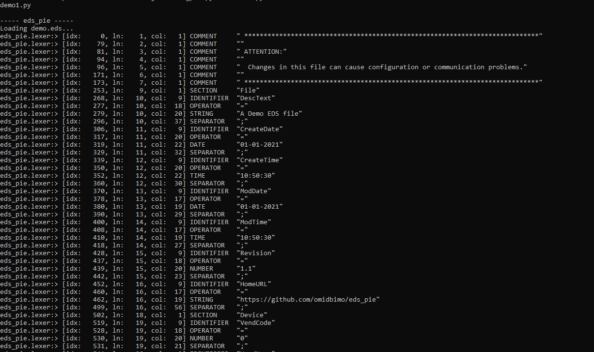

# EDS pie

**A python EDS(Electronic Data Sheet) parser library**


## Who may need an EDS parser library

Use cases:

- ​	Batch processing of EDS files
  - To find out which devices are supporting a specific CIP object or service (i.e. CIP Security)
  - To change contents of a range of EDS files (i.e. Add a new section to all EDSs with a specific ProductCode)
- Automation
  - To implement automated scripts/tests
    - The test script uses EDS_pie to parse the IO assembly path and starts an IO communication
    - To implement QA scripts to make sure the EDS file matches a device configuration
    - To Create new EDS files
- Format conversion
  - To convert EDS data into other formats such as XML / JSON and feed the applications that do not understand the EDS notations


## Usage

```python
# Demo1.py
from eds_pie import *

eds = eds_pie.parse(edsfile = "demo.eds", showprogress = True)
print eds.protocol

```


```python
# Demo2.py

from eds_pie import *

eds = eds_pie.parse(edsfile = "demo.eds", showprogress = True)
eds.list("file")
```




```python
# Demo3.py
from eds_pie import *

eds = eds_pie.parse(edsfile = "demo.eds", showprogress = True)

print eds.getfield("file", "DescText")
print "\"{}\"".format(eds.getfield("file", "DescText").value)

```




```python
# Demo4.py

from eds_pie import *

eds = eds_pie.parse(edsfile = "demo.eds", showprogress = True)

if eds.protocol == "EtherNetIP":
    sec = eds.getsection("device")
    if sec is not None:
        ProductType = sec.getfield("ProdType").value
        if ProductType == 12:
            print "This is an EtherNet/IP Communication adapter device."
```




## API

### EDS object functions

- EDS.list( *[sectionname],* *[entryname]*) To print a list of attributes (sections, entries, fields)

- EDS.getsection( sectionname ) To get the addressed section object
- EDS.getentry( sectionname, entryname ) To get the addressed entry object
- EDS.getfield( sectionname, entryname, fieldindex / fieldname ) To get the addressed field object
- EDS.getvalue( sectionname, entryname, fieldindex / fieldname ) To get the value of an addressed field
- EDS.setvalue( sectionname, entryname, fieldindex, value ) To set value of an addressed field
- EDS.hassection( sectionname )
- EDS.hasenry( sectionname, entryname )
- EDS.hasfield( sectionname, entryname, fieldindex )
- EDS.addsection( sectionname )
- EDS.addentry( sectionname, entryname )
- EDS.addfield( sectionname, entryname, fieldvalue, *[fielddatatype]* )
- EDS.removesection( sectionname )
- EDS.removeentry( sectionname, entryname )
- EDS.removefield( sectionname, entryname, fieldindex )
- EDS.save( *[filename], [overwrite]* )	To save an eds file ( it works but it doesn't beatifulize the output like the EZeds does!)

### EDS object properties

- EDS.protocol 	To get the string protocol name of the eds file (generic, EtherNetIP, ...)
- EDS.sections      To get the list of eds sections

### Section object functions

- section.getentry( entryname )

- section.addentry( entryname )
- section.getfield( entryname, fieldindex / fieldname )

### Section object properties

- section.name			to get string name of the section
- section.entrycount   to get the number of entries for this section
- section.entries          to get a list of this section entries

### Entry object functions

- entry.getfield( fieldindex / fieldname )

- entry.addfield( fieldvalue, *[datatype]* )

### Entry object properties

- entry.name			to get string name of the entry
- entry.fieldcount   to get the number of fields for this entry
- entry.fields           to get a list of this entry fields

### Field object functions

- field.getfield( fieldindex / fieldname )

- filed.addfield( fieldvalue, *[datatype]* )

### Field object properties

- field.name			to get string name of the field

- field.index            to get the index of this field in the of parent entry fields

- field.value            to get / set the value of the field

- field.datatype     to get the data-type object of this field

  

**All object are printable using the print instruction**


## Verbose mode

The parser also supports ***verbosemode*** to control the display output of the parsing flow. Setting the verbose modes true, will display a list of parsed tokens.

```python
from eds_pie import *

eds = eds_pie.parse(edsfile = "demo.eds", showprogress = True, verbosemode = True)
```




